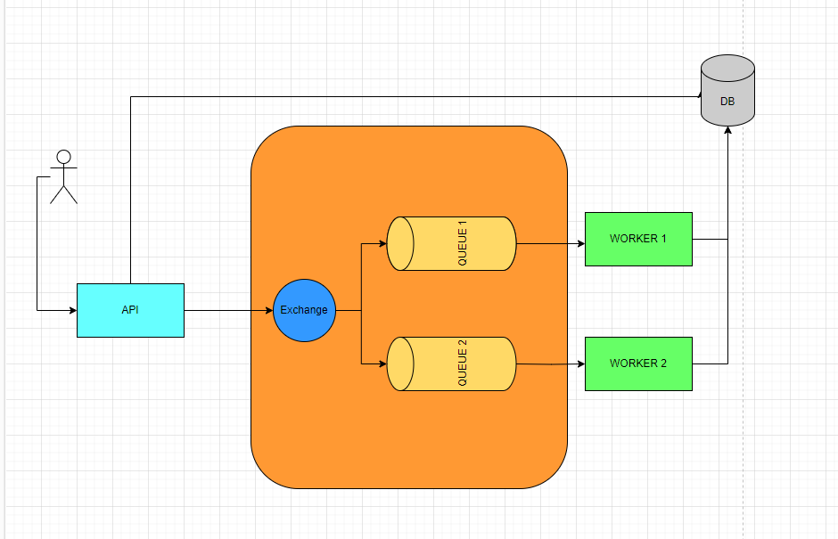
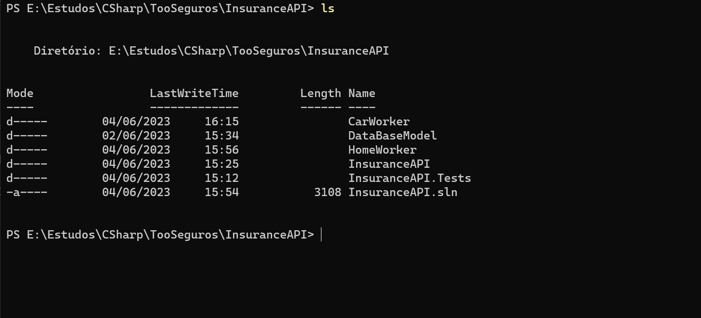

# TooInsurance

## Diagram:


## Rabbit info
 - User: guest
 - Password: guest

## On Windows, after install Docker Desktop, run line below
 - docker run -d --hostname rmq --name rabbit-server -p 8080:15672 -p 5672:5672 rabbitmq:3-management

## On Windows and Linux:
 - Visual Studio 2022 Community Or VS Code
 - Sqlite3
 - SDK .Net 6
 - Entity Framework

## On Library DadaBaseModel Run these commands 
 - dotnet clean
 - dotnet build
 - dotnet ef database update

## Run commands on:
InsuranceAPI
CarWorker
HomeWorker

  ```bash
  
 $ dotnet clean
 $ dotnet build
 $ dotnet run 
 
 ```
 ## Running the app:
 - https://localhost:7184/swagger/index.html
 
 
## Test, on InsuranceAPI.Tests

 ```bash

 $ dotnet test
 or Test/Run All Tests on Visual Studio

 ``` 
## Directories like that:
 
 