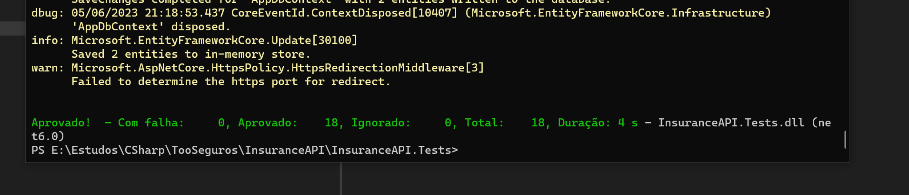
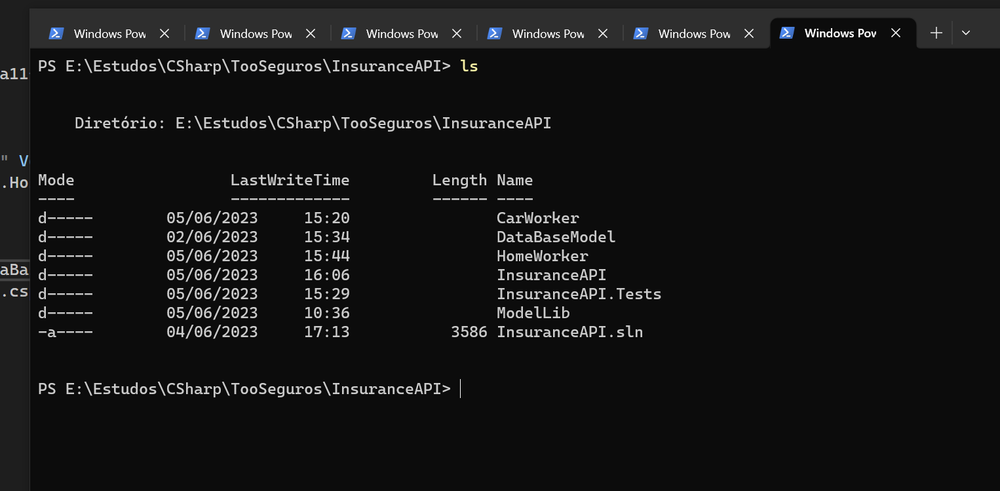

# TooInsurance

## Diagram:


## Rabbit info
 - http://localhost:8080/
 - User: guest
 - Password: guest


## On Windows, after install Docker Desktop, run line below:
 - docker run -d --hostname rmq --name rabbit-server -p 8080:15672 -p 5672:5672 rabbitmq:3-management

## On Windows:
 - Visual Studio 2022 Community Or VS Code
 - Sqlite3
 - SDK .Net 6
 - Entity Framework

## Open 3 Consoles and run each of then, run commands on:
 - InsuranceAPI
 - CarWorker
 - HomeWorker

  ```bash
  
 $ dotnet clean
 $ dotnet build
 $ dotnet run 
 
 ```
 ## Running the app:
 - https://localhost:7184/swagger/index.html
 
 
## Test, on InsuranceAPI.Tests

 ```bash

 $ dotnet test
 or Test/Run All Tests on Visual Studio

 ``` 
 

## Directories like that:
 

 # Cloud Configurations ADD on IaC directory, on Amazon its possible to use Rabbit and Swagger
  - http://18.237.102.130:15672/#/
  - https://18.237.102.130:7184/swagger/index.html

 ## The ip addres change each time the server is up, so, check on hosts.yml to change, and check Instances on AWS to check the IP